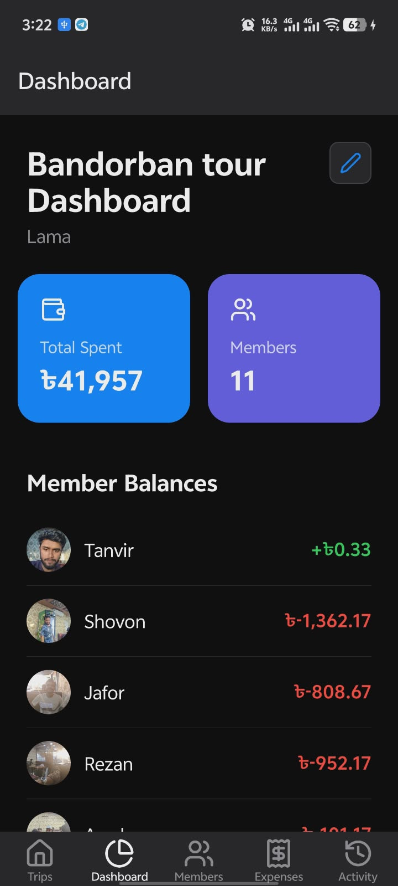
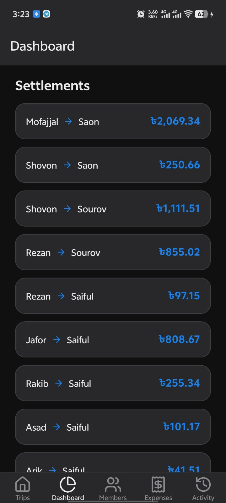
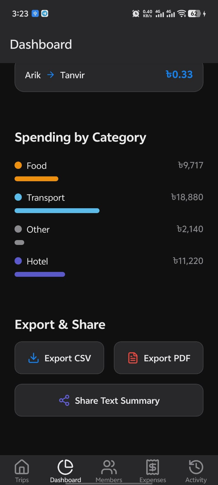
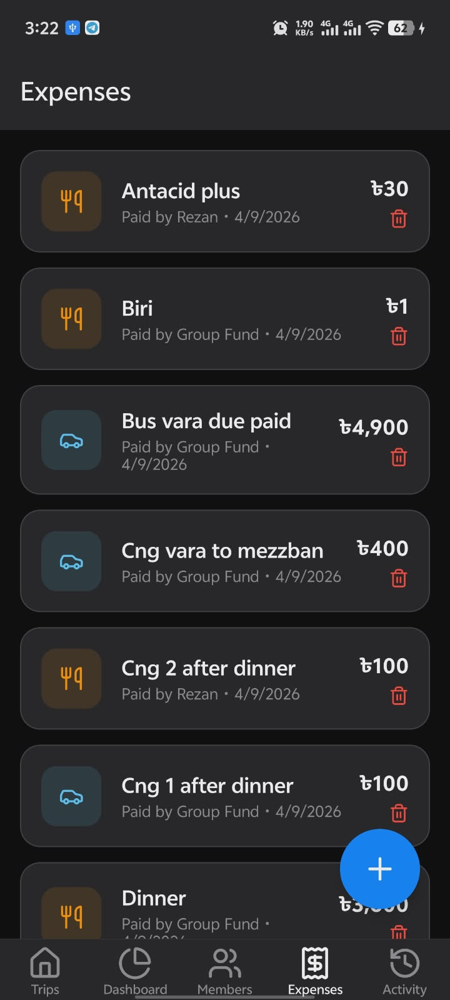
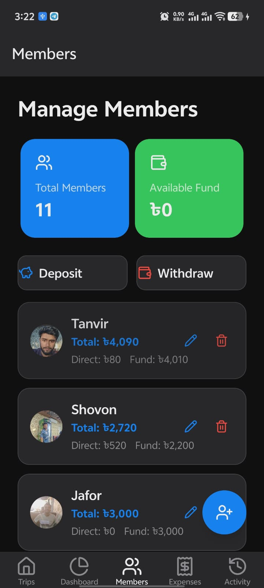
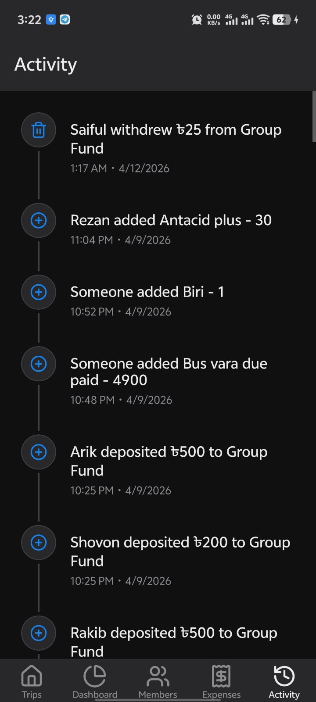

<div align="center">
  
  <h1>✈️ TourMate</h1>
  <p><b>Your Ultimate Trip and Expense Management App</b></p>

[](https://reactnative.dev/)
[](https://expo.dev/)
[](https://www.typescriptlang.org/)
[](https://github.com/pmndrs/zustand)

</div>

<hr>

## 📖 About TourMate

**TourMate** is a robust React Native application built with Expo to make group travel easy. It helps you manage your trips, track group expenses, handle member deposits and withdrawals, and visualize group spending through interactive charts. Say goodbye to the headache of splitting bills manually!

---

## ✨ Features

- **🗺️ Trip Management:** Create, update, and switch between multiple active trips easily.
- **👥 Member Management:** Add friends to a trip, assign profile avatars, and manage group funds (deposits & withdrawals).
- **💸 Expense Tracking:** Log expenses with details (who paid, category, amount) and split costs among trip members.
- **📊 Analytics Dashboard:** Interactive charts built with `victory-native` to visualize your budget and category-wise spending.
- **⚡ Offline First:** Lightning-fast local storage using `react-native-mmkv` to keep your data safe and accessible without the internet.
- **🕰️ Activity Logs:** Automatically logs member additions, expense creations, and fund updates.

---

## 🛠 Tech Stack

| Category          | Technology / Library                                                              |
| ----------------- | --------------------------------------------------------------------------------- |
| **Framework**     | [React Native](https://reactnative.dev/) & [Expo](https://expo.dev/) (SDK 54)     |
| **Routing**       | [Expo Router](https://docs.expo.dev/router/introduction/) (File-based navigation) |
| **State Mgt.**    | [Zustand](https://zustand-demo.pmnd.rs/) (Persisted via MMKV)                     |
| **Local Storage** | [React Native MMKV](https://github.com/mrousavy/react-native-mmkv)                |
| **Charts**        | [Victory Native](https://commerce.nearform.com/open-source/victory-native/)       |
| **UI/Icons**      | [Lucide React Native](https://lucide.dev/), `@gorhom/bottom-sheet`                |

---

## 🚀 Getting Started

Follow these instructions to get the project up and running on your local machine.

### Prerequisites

- [Node.js](https://nodejs.org/) (v18 or higher recommended)
- [npm](https://www.npmjs.com/) or [Yarn](https://yarnpkg.com/)
- [Expo CLI](https://docs.expo.dev/get-started/installation/)
- iOS Simulator or Android Emulator (or a physical device with Expo Go)

### Installation

1. **Clone the repository:**

   ```bash
   git clone https://github.com/Tanvir-Hasan1/TourMate.git
   cd TourMate
   ```

2. **Install dependencies:**

   ```bash
   npm install
   ```

3. **Start the development server:**

   ```bash
   npm start
   ```

4. **Run on your device/emulator:**
   - Press `a` to open in Android emulator
   - Press `i` to open in iOS simulator
   - Scan the QR code with the Expo Go app on your physical device.

---

## 📂 Project Structure

<details>
<summary><b>Click to expand folder structure</b></summary>

```text
TourMate/
├── app/                  # Expo Router file-based routing
│   ├── (tabs)/           # Main tab navigation (Index, Activity, Dashboard, etc.)
│   ├── expense/          # Expense creation and editing screens
│   ├── trip/             # Trip creation and configuration screens
│   └── _layout.tsx       # Root layout file
├── src/                  # Application source code
│   ├── components/       # Reusable UI components
│   ├── constants/        # Theme colors, config, and constants
│   ├── features/         # Feature-specific logic
│   ├── store/            # Zustand global state (TripStore, MMKV config)
│   └── utils/            # Helper functions
├── assets/               # Static assets (images, fonts)
├── package.json          # Project dependencies and scripts
└── tsconfig.json         # TypeScript configuration
```

</details>

---

## 📱 Screenshots

<p align="center">
  
  
  
</p>
<p align="center">
  
  
  
</p>

---

## 🤝 Contributing

Contributions are always welcome! If you have ideas for new features or find a bug, feel free to open an issue or submit a pull request.

1. Fork the Project
2. Create your Feature Branch (`git checkout -b feature/AmazingFeature`)
3. Commit your Changes (`git commit -m 'Add some AmazingFeature'`)
4. Push to the Branch (`git push origin feature/AmazingFeature`)
5. Open a Pull Request

---

## 📄 License

This project is open-source and available under the [MIT License](LICENSE).

<div align="center">
  <i>Made with ❤️ for hassle-free group traveling.</i>
</div>
